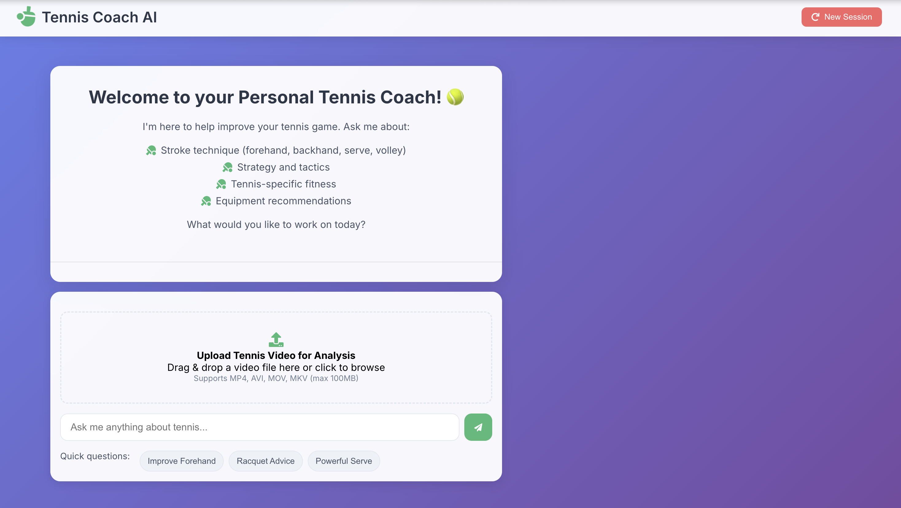
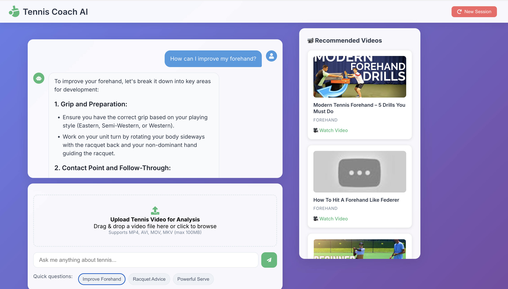
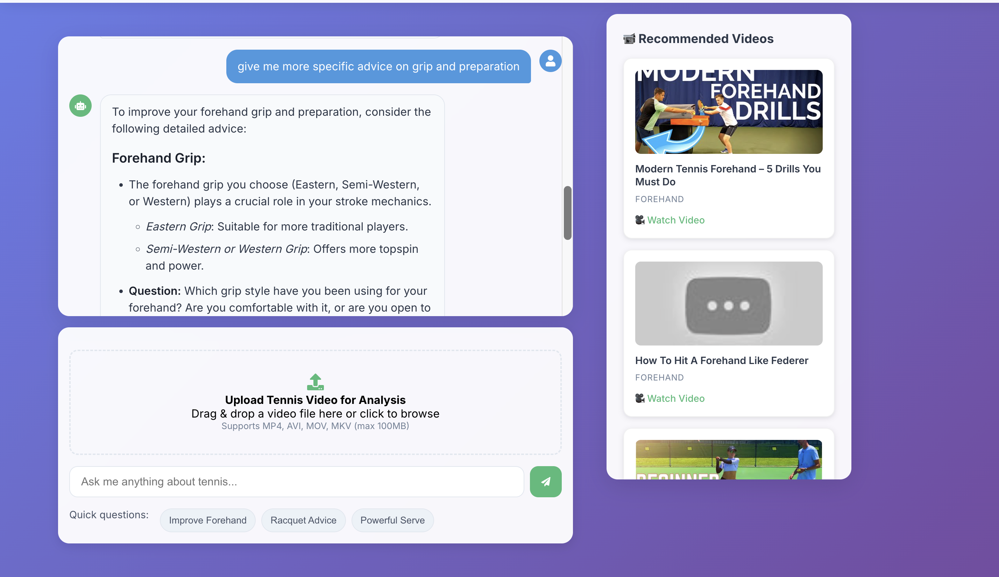

# 🎾 Tennis Coach AI

An AI-powered tennis coaching assistant with a React frontend and Python backend.

## Features

- **Interactive Chat Interface**: Modern React UI with tennis-themed design
- **Knowledge Base**: Comprehensive tennis information covering:
  - Stroke techniques (forehand, backhand, serve, volley)
  - Strategy and tactics for singles/doubles
  - Tennis-specific fitness and conditioning
  - Equipment recommendations
- **Conversation Memory**: Maintains context throughout the session
- **Quick Questions**: Pre-built prompts for common tennis questions

## Setup

### Prerequisites
- Python 3.8+
- Node.js 14+
- OpenAI API key

### Installation

1. **Clone and setup Python environment:**
```bash
python3 -m venv venv
source venv/bin/activate
pip install -r requirements.txt
```

2. **Setup React frontend:**
```bash
cd tennis-coach-ui
npm install
```

3. **Configure environment variables:**
```bash
cp .env.example .env
# Edit .env and add your OpenAI API key and other configuration
```

## Running the Application

### Option 1: Use the start script (recommended)
```bash
./start.sh
```

### Option 2: Start manually
```bash
# Terminal 1 - Backend
source venv/bin/activate
python app.py

# Terminal 2 - Frontend
cd tennis-coach-ui
npm start
```

## Access

- **Frontend**: http://localhost:3000
- **Backend API**: http://localhost:5000

## Project Structure

```
CHATBOT/
├── app.py                 # Flask backend
├── main.py               # Original CLI version
├── knowledge_base/       # Tennis knowledge JSON files
│   ├── strokes.json
│   ├── strategy.json
│   ├── fitness.json
│   └── equipment.json
├── tennis-coach-ui/      # React frontend
│   ├── src/
│   │   ├── App.js
│   │   ├── index.js
│   │   └── index.css
│   ├── public/
│   └── package.json
└── start.sh             # Startup script
```

## Knowledge Base

The knowledge base contains structured information about:
- **Strokes**: Detailed technique guides for all major tennis strokes
- **Strategy**: Singles and doubles tactics, mental game tips
- **Fitness**: Tennis-specific conditioning and nutrition advice
- **Equipment**: Racquet, string, and gear recommendations

## API Endpoints

- `POST /chat` - Send message to tennis coach
- `POST /reset` - Reset conversation history
- `GET /` - API status check
# 🎾 Tennis Coach AI

Tennis Coach AI is a web-based application that provides **personalized tennis coaching** through AI-powered feedback and video analysis.  
It helps users improve their **stroke technique, strategy, fitness**, and even get **equipment recommendations**.

---

## 🌟 Features
- **Stroke Technique Guidance** – Improve forehand, backhand, serve, and volley.
- **Video Upload & Analysis** – Upload your tennis video for AI-driven breakdown and tips.
- **Strategy & Tactics** – Get recommendations on how to outsmart your opponents.
- **Tennis Fitness Advice** – Improve your tennis-specific fitness levels.
- **Equipment Recommendations** – Learn which gear suits your playing style.

---

## 🚀 Demo

### **1. Home Screen**
Welcome screen introducing the AI tennis coach and its features.



---

### **2. Asking for Coaching Advice**
Get AI-driven, step-by-step advice for improving specific areas of your game.



---

### **3. Detailed Follow-up Guidance**
Request more specific tips to refine your technique.



---

## 🌍 Public Access
At this time, there is **no publicly accessible version** of Tennis Coach AI.

This is because the app relies on external APIs for advanced features like:
- AI-powered video analysis
- Real-time tennis coaching advice
- Strategy recommendations

These services are **usage-based and paid**, which could lead to significant costs if the app was made public.  

If you would like to **request access** or express interest in trying out the app, please fill out this form:  
[**Enquiry Form**](https://docs.google.com/forms/d/e/1FAIpQLSeRUqa2cv2fpj0VCQAOHVm6izMR5TFkwjr6-g_DuY-5VhE3ig/viewform?usp=header)
